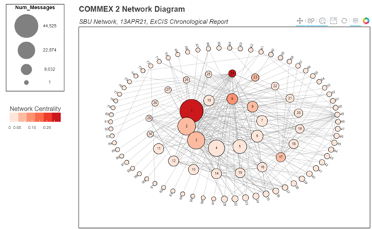

# Tactical_Network_Analysis
Demonstration of tools used to perform data analysis and data visualization of high-throughput tactical networks used in experimentation.  

Key tools: `bokeh`, `networkx`, `pandas`.  

Click to view interactive network visualization:

## References

Kenneth D Renard, J. R. (2015). High-Bandwidth Tactical-Network Data Analysis in a High-Performance-Computing (HPC) Environment: Introduction. US Army Research Laboratory.
